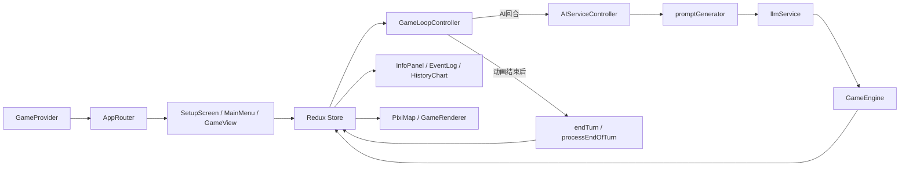

# Notion 文档中心页面本地归档

## 归档说明

- 归档日期：2026-05-01
- 来源：Notion `silicon-hegemony` 文档中心
- 文档中心 URL：https://app.notion.com/p/33b79afa479080e7866cc9533046e98a
- 迁移索引：`docs/migrations/2026-05-01-online-docs-migration-index.md`

## silicon-hegemony

- URL：https://app.notion.com/p/33b79afa479080e7866cc9533046e98a

# Silicon Hegemony 文档中心

这里是 Silicon Hegemony 的长期维护入口页。当前页面不再承担所有细节说明，而是负责提供项目状态、文档导航、需求入口和维护约定。

## 项目当前状态

- 项目形态：AI 驱动的 web 大战略游戏原型，已具备持续开发基础。
- 当前仓库：`Vite + React` 前端项目，包含 UI、核心模拟逻辑、地图渲染、AI 调度与联机客户端。
- 构建状态：`npm run build` 已于 2026-04-07 验证通过。
- 测试现状：当前仓库尚未发现项目自身测试文件。
- 联机现状：前端默认连接 `http://localhost:8080`，联机依赖独立后端服务。

## 这套文档怎么用

1. 先看“产品与项目总览”，理解项目定位和当前目标。
2. 需要改代码结构时，看“系统架构与运行流程”。
3. 需要确认哪些功能已做、哪些仍缺时，看“功能模块与现状清单”。
4. 需要确认当前规则、数值和结算逻辑时，看“规则手册（当前实现版）”。
5. 需要处理联机依赖、房间流程和消息协议时，看“联机协议与运行依赖”。
6. 需要规划测试或做回归时，看“测试与回归策略”。
7. 后续新需求进入时，优先登记到“需求池 Backlog”，开发前后同步更新对应文档。

## 需求池使用约定

- 所有新需求、Bug、重构项、文档任务，优先进入需求池。
- 进入需求池时至少补齐：`状态`、`优先级`、`类型`、`模块`、`来源`、`验收标准`。
- 需求被确认后，再拆分为具体开发动作。
- 需求完成后，需要同步更新相关文档，而不是只改代码。

## 当前已经放入的起始事项

- 为核心结算与行动系统补基础测试
- 补齐联机协议与后端依赖说明
- 优化 AI 配置体验并引入模板化方案
- 为地图模式补充图例与信息提示
- 建立版本规划与发布记录规范

## 当前维护重点

- 把现有原型沉淀成可持续扩展的开发底座。
- 优先补齐规则测试、联机边界文档和需求治理。
- 在不推翻现有架构的前提下，逐步增强玩法深度、观察体验和开发效率。

## 当前风险提醒

- 缺少自动化测试，规则系统继续扩展时回归风险较高。
- API Key 目前由前端直接配置，只适合开发 / 内测环境。
- 联机后端不在当前仓库中，前后端边界仍需要进一步文档化。
- 地图渲染和规则系统都在快速演化，后续应持续同步架构文档。
- 当前 X-ai 团队还在使用 `x-ai-gateway` 与 `ai-gateway`，本项目文档和任务推进需要保持 `silicon-hegemony` 范围，不与网关项目混杂。

## 子页面

- 01｜产品与项目总览
- 02｜系统架构与运行流程
- 03｜功能模块与现状清单
- 04｜持续开发指南
- 05｜规则手册（当前实现版）
- 06｜联机协议与运行依赖
- 07｜测试与回归策略
- 需求实现｜OpenAI-Compatible 收敛 + 球形地球地图 + 首页文档置顶（2026-04-10）
- 需求实现｜全球国家玩法重构（2026-04-10）
- 优化实现｜删除模型下拉框 + 地球拖拽性能优化（2026-04-10）
- 需求实现｜核心规则自动化测试第一批（2026-04-10）
- 优化实现｜地图边界增强 + 地球旋转性能继续优化（2026-04-10）
- 优化实现｜globe 背景改成 Canvas/Texture 方案（2026-04-10）
- 优化实现｜交互层粗细分级渲染（2026-04-10）
- 需求实现｜行政区细分 + 继续优化绘制性能（2026-04-10）
- Bug修复｜gateway client key 缺失导致 AI Unauthorized（2026-04-10）
- 优化实现｜地图显示精度提升（2026-04-11）

## 01｜产品与项目总览

- URL：https://app.notion.com/p/33b79afa47908193b433c4264a27a4c0

Silicon Hegemony 是一个由 AI 驱动的 web 大战略游戏原型。玩家通过配置势力、AI 指挥官原型和模型服务，在美国州级地图上观察或参与一场关于扩张、补给、外交、危机和技术发展的沙盒推演。

### 当前产品目标

- 先做出一个可持续演化的战略模拟原型，而不是一次性剧情游戏。
- 强调“观察 AI 决策 + 人类介入配置”的体验差异。
- 让规则系统足够清晰，使后续功能扩展不会推翻现有骨架。
- 为后续持续开发保留模块边界：规则、AI、UI、联机、渲染尽量分层。

### 当前体验定位

- 类型：大战略 / 4X / 沙盒模拟。
- 角色：玩家既可以直接控制势力，也可以作为“导演”配置多个 AI 后观察演化。
- 节奏：回合推进、状态结算、日志观察、历史回看。
- 主舞台：美国州级地图。

### 当前代码里已经成形的玩法闭环

1. 进入本地模式或联机模式。
2. 配置 2-8 个势力，决定人类 / AI 控制方式。
3. 为 AI 设置原型、补充策略、模型服务参数。
4. 启动模拟，系统进入轮流行动。
5. 势力执行建设、移动、攻击、外交、宣传、科研、谍报等行动。
6. 回合末统一结算经济、人口、补给、满意度、叛乱、危机与同盟。
7. 玩家通过地图、日志、图表和历史快照观察结果。

### 当前版本已实现的核心卖点

- AI 势力可由外部 LLM 驱动，而不是纯本地脚本权重。
- Prompt 中包含可见领土、外交关系、近期事件、邻接关系等上下文。
- 地图支持多视图：政治、补给、经济、军事、赛博。
- 有完整的回合推进与年内季节循环。
- 已有联机大厅、认领势力、房主开局等共享模拟基础。

### 当前仓库快照

- 前端：`React 18` + `Vite 7`
- 状态管理：`Redux Toolkit`
- UI：`MUI`
- 地图渲染：`Pixi.js`
- AI SDK：`@google/genai`、`openai`
- 联机通信：`SockJS`、`STOMP`
- 构建状态：`npm run build` 已于 2026-04-07 验证通过
- 测试现状：当前仓库未发现项目自身测试文件

## 02｜系统架构与运行流程

- URL：https://app.notion.com/p/33b79afa479081adaae1deb07fe648dd

### 架构目标

- 用 `Redux store` 承载统一游戏状态。
- 用 `GameEngine` 和规则模块处理核心模拟逻辑。
- 用 `AIServiceController` 管理 AI 决策请求。
- 用 `Pixi.js` 负责地图视觉层。
- 用 `MUI + React` 负责配置与信息面板。
- 在本地模式和联机模式之间尽量复用同一套前端规则执行链路。

### 顶层结构

### 运行模式

本地模式由 `LocalGameClient` 驱动。启动游戏时调用 `startGame` thunk 创建初始状态；AI 回合由前端生成 Prompt，再通过 Next.js 同源 API Route 请求 `OpenAI API / OpenAI-compatible` 接口并执行结果；回合结束后由本地 thunk 调用 `GameEngine.completeTurnForFaction`。

联机模式由 `OnlineGameClient` 驱动。前端通过 `SockJS + STOMP` 连接 `http://localhost:8080/ws-entry`；房主负责主要逻辑推进与 AI 广播执行；大厅阶段支持加入房间、认领势力、配置 AI、准备、开局。

### 状态管理分层

- `gameSlice`：世界状态、暂停控制、地图模式、视图状态、动画队列。
- `historySlice`：快照与历史回看。
- `roomSlice`：连接状态、房间信息、玩家列表、势力配置。
- `uiSlice`：全局错误和 snackbar 反馈。

### 游戏主循环

1. `GameEngine.prepareTurn` 为当前势力准备回合并发放 `AP`。
2. 若当前势力是人类，则进入 `awaiting_human_input`。
3. 若当前势力是 AI，则 `GameLoopController` 触发 `AIServiceController.generateTurn`。
4. `promptGenerator` 根据世界状态生成 Prompt。
5. `llmService` 调用模型并返回 JSON 行动计划。
6. `GameEngine.processTurnForFaction` 校验并执行行动。
7. 行动完成后写入日志、更新动画队列。
8. `GameLoopController` 监听动画队列清空后结束回合。
9. 若一轮势力循环完成，则 `processEndOfTurn` 做全局结算。

### 地图渲染链路

- `GameMap` 负责交互与气泡层。
- `PixiMap` 负责地图组件封装。
- `GameRenderer` 负责 Pixi 应用初始化与图层协调。
- 图层包含：`GridLayer`、`TerritoryLayer`、`BorderLayer`、`LinkLayer`、`IconLayer`、`AnimationLayer`、`WeatherLayer`。
- `selectors.js` 中的 `selectTerritoryVisuals` 会根据 `mapMode` 输出不同可视化风格。

### 回合末结算职责

`turnProcessor.js` 负责经济与人口增长、首都重定与补给线判断、补给网络与军队损耗、算力增长、民兵恢复、临时状态清理与外交时效、满意度传播与宣传塔影响、叛乱与中立化、全球危机触发与持续、势力总量更新与反霸权同盟判断。

## 03｜功能模块与现状清单

- URL：https://app.notion.com/p/33b79afa47908116ae79df38c49220af

### 游戏入口与模式选择

已实现 `GameProvider` 提供本地 / 联机模式选择，`AppRouter` 根据模式和游戏状态在在线主菜单与正式游戏界面之间切换。后续建议补充统一首页信息，包括版本号、更新摘要、服务器连接状态。

### SetupScreen 配置流程

已实现 2-8 势力数量配置、人类 / AI 控制切换、AI 指挥官原型选择、补充策略文本、`OpenAI` 与 `自定义 OpenAI-Compatible` 接口配置、本地存储恢复与清空、单势力配置模式在联机大厅中复用。风险是 API Key 放在本地存储，不适合生产环境。

### 核心规则与行动系统

已实现的行动包括 `RECRUIT`、`ATTACK`、`MOVE`、`BUILD_FACTORY`、`BUILD_CIVILIAN_FACTORY`、`BUILD_FORTIFICATION`、`BUILD_PROPAGANDA_TOWER`、`PROPAGANDA`、`LOBBYING`、`SCOUT`、`ESPIONAGE`、`SET_TAX_RATE`、`PROPOSE_NON_AGGRESSION_PACT`、`PROPOSE_TRADE_AGREEMENT`、`RESEARCH_ATTACK`、`MOVE_SUPPLY`、`BUILD_SUPPLY_DEPOT`、`CHOOSE_DOCTRINE`、`RESEARCH_DOCTRINE`、`RECRUIT_GENERAL`、`MOVE_GENERAL`、`CYBER_ATTACK_BLACKOUT`、`CYBER_ATTACK_HEIST`、`CYBER_ATTACK_DEEPFAKE`。

### 回合结算系统

已实现季节轮换、补给网络、补给线判断、军队损耗、满意度变化、宣传传播、叛乱、全球危机、反霸权同盟、民兵恢复、外交效果衰减。风险是规则越来越多后，缺少自动化测试会提高回归风险。

### 地图与可视化系统

已实现领土 hover 弹层、政治 / 补给 / 经济 / 军事 / 赛博地图模式、Pixi 图层化渲染、动画队列机制、天气图层与地图视觉常量。建议增加更明确的图例，并区分战斗动画、移动动画、谍报动画、赛博动画。

### 当前明确缺口

- 项目自身测试缺失
- 需求池与版本计划刚开始建设
- 规则文档和 UI 文档尚未彻底拆开
- 后端文档缺失
- 部署、环境变量、安全规范未成体系

### 适合优先推进的模块

1. 文档与需求池规范化
2. 核心规则测试化
3. AI 配置体验优化
4. 联机协议补齐
5. 地图表现与性能优化

## 04｜持续开发指南

- URL：https://app.notion.com/p/33b79afa479081f6bce0c60330d325cd

目标是约束后续新增需求进入项目时的处理方式，避免项目继续迭代后文档和代码失去同步。

### 推荐的需求流转方式

1. 新需求先进入需求池。
2. 为需求补齐背景、目标、优先级、涉及模块和验收标准。
3. 判断需求类型：`Feature`、`Bug`、`Refactor`、`Docs`、`Research`。
4. 需求确认后，再拆成具体开发任务。
5. 开发前同步更新相关设计文档或模块说明。
6. 开发完成后补充验证记录和结果说明。

### 文档维护原则

- 主页面负责导航、项目状态和维护说明。
- 架构文档负责回答“系统怎么跑”。
- 功能文档负责回答“已经做了什么、缺什么”。
- 需求池负责回答“接下来做什么”。
- 版本推进过程中，尽量不要把产品目标、技术架构、需求待办混写在同一页。

### 项目边界

当前 X-ai 团队同时在使用 `x-ai-gateway` 与 `ai-gateway`。`silicon-hegemony` 的需求、Bug、文档、实现和交付不得混入上述两个网关项目的任务。

### 开发检查清单

- [ ] 是否明确需求背景与目标
- [ ] 是否标记优先级
- [ ] 是否确认影响的模块
- [ ] 是否定义验收标准
- [ ] 是否评估会不会影响 AI、联机或地图渲染
- [ ] 是否更新对应 Notion 文档
- [ ] 是否做最基本的构建验证

### 建议的近期开发里程碑

- 里程碑 A：完善需求池与文档结构、为核心结算与行动系统补基础测试、清理关键模块边界与注释、记录联机依赖和部署方式。
- 里程碑 B：强化 AI 配置模板、丰富日志筛选与信息面板、增加规则说明与图例、完善战斗 / 危机 / 外交可视化反馈。
- 里程碑 C：梳理版本路线图、建立更稳定的后端接口契约、考虑存档、复盘、统计和对局分享。

## 05｜规则手册（当前实现版）

- URL：https://app.notion.com/p/33b79afa479081f2ac3cf24e3d935166

本页记录当前代码已经实现或明确声明的规则，主要依据 `src/game/constants.js`、`src/game/turnProcessor.js`、`src/game/actionValidation.js`、`src/game/actionHandlers/*`、`src/engine/GameEngine.js`。

### 核心资源

- `Money`：用于建造、科研、宣传、游说、谍报等消耗，主要来自领土税收与贸易收益。
- `Action Points (AP)`：每回合核心行动资源，基础公式为 `5 + floor(领土数 / 5)`；多数行动消耗 `1 AP`；非法行动会惩罚扣除 `1 AP`。
- `Supply`：由 `civilian_factories` 在回合末产出，被正规军和民兵持续消耗；补给短缺会导致攻击减半和正规军损耗。
- `Computing Power`：赛博相关资源，由 `server_node_level` 在回合末累积。

### 势力与领土关键状态

势力层状态包括 `money`、`computing_power`、`actionPoints`、`tax_rate`、`attack_bonus`、`doctrine`、`techLevel`、`generals`、`avgSatisfaction`、`longTermGoal`、`shortTermObjective`。

领土层状态包括 `owner`、`terrain`、`population`、`army.regulars`、`army.militia`、`satisfaction`、`money_yield`、`factories`、`civilian_factories`、`fort_level`、`propaganda_towers`、`supply`、`supply_depots`、`is_capital`、`is_supplied`、`has_supply_shortage`、`server_node_level`、`generalId`、`is_blackout`、`sabotaged_turns`。

### 回合结构

1. 准备回合：`prepareTurn` 设置当前活动势力、发放 AP、切换到人类或 AI 输入阶段。
2. 规划与提交：玩家通过界面提交行动；AI 通过 Prompt + LLM 生成行动计划。
3. 行动执行：`processTurnForFaction` 逐条验证行动并交给 handler 执行。
4. 动作收尾：动画队列清空后结束该势力回合。
5. 整轮结算：所有存活势力完成回合后执行 `processEndOfTurn`。

### 行动合法性总则

当前检查出发地 / 目标地是否存在、是否属于己方或敌方、必要参数是否填写、兵力或补给是否超过库存、特定行动是否指定目标势力 / 领土 / 路线 / 将领、停电影响下部分移动类行动是否失效。

### 已实现行动目录

- 军事行动：`ATTACK`、`MOVE`、`MOVE_SUPPLY`
- 招募与建设：`RECRUIT`、`BUILD_FACTORY`、`BUILD_CIVILIAN_FACTORY`、`BUILD_FORTIFICATION`、`BUILD_PROPAGANDA_TOWER`、`BUILD_SUPPLY_DEPOT`
- 政治与经济：`PROPAGANDA`、`LOBBYING`、`SET_TAX_RATE`、`RESEARCH_ATTACK`
- 外交与侦察：`PROPOSE_NON_AGGRESSION_PACT`、`PROPOSE_TRADE_AGREEMENT`、`SCOUT`、`ESPIONAGE`
- Doctrine / 将领 / 赛博：`CHOOSE_DOCTRINE`、`RESEARCH_DOCTRINE`、`RECRUIT_GENERAL`、`MOVE_GENERAL`、`CYBER_ATTACK_BLACKOUT`、`CYBER_ATTACK_HEIST`、`CYBER_ATTACK_DEEPFAKE`

### 关键成本

`BUILD_FACTORY=500`、`BUILD_FORTIFICATION=250`、`PROPAGANDA=100`、`SCOUT=150`、`BUILD_PROPAGANDA_TOWER=400`、`LOBBYING=300`、`ESPIONAGE=750`、`BUILD_CIVILIAN_FACTORY=300`、`BUILD_SUPPLY_DEPOT=200`、`RECRUIT_GENERAL=1000`、`RESEARCH_ATTACK_BASE=700`、`DOCTRINE_LEVEL_BASE=1000`、`CYBER_BLACKOUT=50`、`CYBER_HEIST=100`、`CYBER_DEEPFAKE=300`。

### 战斗、地形与后勤

地形类型包括 `PLAINS`、`MOUNTAIN`、`DESERT`、`URBAN`、`SWAMP`，影响移动消耗、进攻修正、防守修正、损耗修正。补给公式包括每座民用工厂基础产出 `75 supply`，每名正规军 upkeep `1.5`，每名民兵 upkeep `1.0`，无补给攻击惩罚为最终战斗力 `x 0.5`。

### 经济、人口、满意度、危机与同盟

领土收入与 `money_yield`、满意度、税率有关；人口在回合末增长并受满意度与季节影响；满意度过低会提高叛乱风险；全球危机包括 `THE_AWAKENING`、`BIO_PLAGUE`、`MARKET_CRASH`；某势力军力过强时其余势力可自动形成反霸权联盟。

## 06｜联机协议与运行依赖

- URL：https://app.notion.com/p/33b79afa4790811b95b6e906529c04b0

本页基于当前前端仓库可见代码，整理联机模式所依赖的接口、消息流和运行边界。它描述的是前端视角下的协议与依赖，不是完整服务端实现文档。

### 联机模式组成

- 前端界面：`MainMenu`、`RoomList`、`Lobby`
- 状态管理：`roomSlice`
- 客户端抽象：`GameClient`
- 在线实现：`OnlineGameClient`
- 服务器依赖：REST API + WebSocket/STOMP

### 当前固定依赖

- `SERVER_URL = http://localhost:8080`
- `WEBSOCKET_URL = http://localhost:8080/ws-entry`
- WebSocket 客户端：`SockJS`
- 消息协议：`STOMP`

### REST 接口

- `GET /api/rooms`：获取可加入房间列表。
- `POST /api/rooms`：创建房间，请求体包含 `name`、`isPublic`、`maxPlayers`、`hostPlayerId`、`hostPlayerName`。

### 订阅主题

- `/topic/rooms/{roomId}/lobby`
- `/topic/rooms/{roomId}/game-started`
- `/topic/rooms/{roomId}/prepare-turn`
- `/topic/rooms/{roomId}/execute-turn`
- `/topic/rooms/{roomId}/speed-changed`

### 发送目的地

- `/app/rooms/{roomId}/join`
- `/app/rooms/{roomId}/config-all`
- `/app/rooms/{roomId}/claim`
- `/app/rooms/{roomId}/config`
- `/app/rooms/{roomId}/ready`
- `/app/rooms/{roomId}/player-status`
- `/app/rooms/{roomId}/start`
- `/app/rooms/{roomId}/reset`
- `/app/rooms/{roomId}/speed`
- `/app/rooms/{roomId}/broadcast-execute-turn`

### AI 在联机模式中的执行方式

只有房主会在联机模式下真正触发 AI 推理。房主本地读取游戏状态，通过 `AIServiceController.generateTurn` 生成行动计划，成功后向 `/broadcast-execute-turn` 广播执行指令，所有客户端接收后执行同一份行动结果。

### 当前缺口

- 没有独立的服务端接口文档。
- 没有消息 payload 的正式 schema 文档。
- 断线重连、主机转移、异常恢复策略未系统化说明。
- 缺少前后端版本兼容策略。

## 07｜测试与回归策略

- URL：https://app.notion.com/p/33b79afa479081c28dc5e453f504d18a

### 当前现状

- 已有 `build`、`lint` 等基础脚本。
- 当前仓库尚未发现项目自身测试文件。
- 规则、状态流、联机和渲染都在持续演化，回归风险正在上升。

### 测试目标

短期目标是保护最核心、最容易回归的规则逻辑，保证每次改动后至少能快速确认“游戏还能跑、回合还能结算”。中期目标是为关键模块建立稳定的单元测试与集成测试。长期目标是建立“规则层可自动验证、界面层可烟雾验证、联机层有关键路径回归”的测试体系。

### 当前最高风险模块

- `turnProcessor.js`
- `GameEngine.js`
- `actionHandlers/*`
- `AIServiceController + promptGenerator + llmService`
- `OnlineGameClient`
- `Pixi` 渲染链路

### 建议测试分层

1. 纯规则单元测试：覆盖回合末结算、补给网络、无补给损耗、税率与满意度、叛乱、危机、胜利条件。
2. 状态推进集成测试：覆盖开局初始化、`prepareTurn`、`processTurnForFaction`、`completeTurnForFaction`、非法行动 AP 惩罚。
3. UI / 流程烟雾测试：覆盖本地模式开局、配置保存、GameView 渲染、暂停 / 重置、地图模式切换。
4. 联机关键路径回归：覆盖创建房间、加入房间、认领势力、配置 AI、全员准备、房主开局、AI 回合广播。

### 推荐建设顺序

1. 先补规则层测试。
2. 再补 `GameEngine` 的集成测试。
3. 再为关键 UI 做基础烟雾测试。
4. 最后再建设联机自动化回归。

### 最小回归清单

- 改规则后：开局成功、AI 回合能推进、玩家回合能提交行动、回合末结算不报错、无补给惩罚正确、历史回看可用。
- 改 Setup / AI 配置后：本地配置能保存和恢复、OpenAI-Compatible Proxy 配置校验正常、AI 调用失败时不会卡住游戏。
- 改联机后：能连接服务器、拉取房间、创建 / 加入房间、同步 Lobby、房主 AI 推理只触发一次。
- 改 Pixi / 地图后：地图正常显示、hover 信息正确、5 种地图模式可切换、动画播放后回合能继续推进、视觉表现和真实状态一致。

## 需求实现｜OpenAI-Compatible 收敛 + 球形地球地图 + 首页文档置顶（2026-04-10）

- URL：https://app.notion.com/p/33e79afa47908137ba46e48720893432

### 背景与目标

用户要求项目只保留 OpenAI-compatible 格式，移除其他格式；地图改为球型完整地球地图；在首页文档最顶端放置 Notion 文档入口；严格遵循先文档、再任务、后编码的工作流。

目标是将 AI 接入体验收敛为单一 OpenAI-compatible 配置模式，将地图视觉从美国平面矢量图升级为球型完整地球地图，并将 Notion 项目文档入口放到首页文档最顶端。

### 实现结果

- AI 配置已收敛为单一 `OpenAI-Compatible` 模式，移除了多 provider 选择与 preset 逻辑。
- 旧配置会在读取时统一归一化到 `openai_compatible`，并保留 `API Key`、`Base URL`、`model` 与测试连接能力。
- 地图已切换为球型地球视图，底图使用更高精度的全球国家边界数据。
- 地图支持拖拽查看完整世界范围，滚轮缩放仍可使用。
- 当前州级玩法、领土交互与现有规则仍保留，没有在本轮扩展为全球国家玩法。
- `README.md` 顶部已加入 Notion 文档中心链接。

### 验证与遗留问题

- `npm run lint`：通过。
- `npm run build`：通过。
- Playwright 在当时 Windows 环境遇到 `EPERM: operation not permitted, mkdir 'C:\\Windows\\System32\\.playwright-mcp'`，未完成自动化截图核验。
- 遗留：玩法领土体系仍是美国州级模型；球形地图拖拽会触发几何重投影，后续需关注缓存或降采样优化。

## 需求实现｜全球国家玩法重构（2026-04-10）

- URL：https://app.notion.com/p/33e79afa479081489a19dfd9b1feebc9

### 背景与目标

用户明确：不仅地图要显示完整世界，玩法也要扩成全球国家。目标是将州级玩法体系升级为全球国家级玩法体系，让地图显示、可玩领土、邻接关系、地形/节点、初始局势和提示词上下文保持一致，并补充项目内 Playwright 验证能力。

### 实现结果

- 玩法领土已从美国州级模型切换为全球国家 / 地区模型。
- 地图 geometry、国家目录、邻接关系、初始化、提示词上下文与季节影响共享同一份全球国家数据源。
- 全球国家邻接关系通过 `world-atlas` TopoJSON 自动推导，不再维护美国州静态邻接表。
- 领土初始化改为基于国家目录生成基础人口、收入、节点等级与首都候选。
- 球形地球继续保留，并与国家级可玩领土一致。
- 项目内已安装 `playwright`，并新增 `npm run playwright:smoke`。

### 验证与遗留问题

- `npm run lint`、`npm run build`、`npm run playwright:smoke` 通过。
- 遗留：国家基础属性按规则生成，不是严格现实数据库；海岛国家保留拓扑精确邻接，部分孤岛无陆地邻接。

## 优化实现｜删除模型下拉框 + 地球拖拽性能优化（2026-04-10）

- URL：https://app.notion.com/p/33e79afa479081dc9526d3af3afa1133

### 背景与目标

用户要求删除 OpenAI-Compatible 配置界面的“快速选择模型”下拉框，并调查优化球形地球拖拽卡顿问题。

### 实现结果

- 删除“快速选择模型”下拉框，仅保留模型名称输入框。
- 将旋转更新节流到 `requestAnimationFrame`，避免每个 pointermove 都直接触发 React 更新。
- 移除 GlobeLayer 中每次旋转都走 Pixi `svg()` 解析的路径，改为轻量球体背景绘制。
- 避免 TerritoryLayer 在每次 geometry 更新时销毁并重建全部 `Graphics` 实例，改为增量复用。

### 资料结论与验证

- D3 `geoPath` 在提供 `context` 时可直接渲染到 Canvas，而不是生成 SVG path 字符串。
- Pixi 性能建议指出频繁修改复杂 `Graphics` 会慢，数百个复杂图形优先考虑转成 texture / sprite。
- `npm run lint`、`npm run build`、`npm run playwright:smoke` 通过。

## 需求实现｜核心规则自动化测试第一批（2026-04-10）

- URL：https://app.notion.com/p/33e79afa479081b29c5ae8c000408422

### 背景与目标

当前项目已完成全球国家玩法、地图交互、AI 配置与 Playwright 烟测等关键改造；最高风险模块是 `turnProcessor.js` 与 `GameEngine.js`。目标是为核心规则层补第一批自动化测试基础，保护最容易回归、最影响主循环稳定性的逻辑。

### 实现结果

- 新增仓库级测试脚本：`npm run test`。
- 使用 Node 原生 test runner 建立第一批核心规则自动化测试。
- 覆盖 `mapUtils`、`utils`、`GameEngine`、`turnProcessor`。
- 顺手修正规则层与动作处理层一批历史遗留的无扩展名 ESM import。

### 验证

- `npm run test`：通过（7 个测试全部通过）。
- `npm run lint`：通过。
- `npm run build`：通过。

## 优化实现｜地图边界增强 + 地球旋转性能继续优化（2026-04-10）

- URL：https://app.notion.com/p/33e79afa479081bc9a6ae098030cec17

### 背景与目标

用户反馈国家边界线不够明显，拖动旋转地球依然明显卡顿。目标是提升国家边界可读性，继续优化旋转交互，降低拖动卡顿。

### 实现结果

- 增强默认国家描边，让政治视图下的国家边界更清晰。
- 将边界可读性部分转移到 `TerritoryLayer` 自身描边，减少完全依赖 `BorderLayer`。
- 新增“拖拽中低开销、停下后高质量”的交互模式：旋转过程中启用降采样几何、暂停 `BorderLayer` 重边界计算，旋转结束后恢复高质量几何。

### 结论与验证

卡顿不只是 SVG/path 问题，更大的成本来自每次拖动触发的整套国家重投影和图层重绘。`npm run test`、`npm run lint`、`npm run build`、`npm run playwright:smoke` 通过。

## 优化实现｜globe 背景改成 Canvas/Texture 方案（2026-04-10）

- URL：https://app.notion.com/p/33e79afa479081b1a13ee59cc8fe2b6e

### 背景与目标

用户要求继续推进，把 globe 背景彻底改成 `Canvas / texture` 方案。目标是将 `GlobeLayer` 从纯 `Graphics` 即时绘制改造成基于 `Canvas` 生成 texture / sprite 的方案，让背景层转为低频更新。

### 实现结果

- `GlobeLayer` 已从即时 `Graphics` 绘制改为 `Canvas -> Texture -> Sprite` 路径。
- 背景层现在会缓存 texture，不再在常规更新中参与高频矢量绘制。
- 旋转交互期间临时隐藏 `IconLayer` / `LinkLayer`，进一步减少重绘压力。
- 保留此前的旋转降采样与边界增强策略。

### 验证

`npm run test`、`npm run lint`、`npm run build`、`npm run playwright:smoke` 通过。结论是 Globe 背景已经彻底走 Canvas/texture 路径，当前最大成本仍是国家级 territory 重投影。

## 优化实现｜交互层粗细分级渲染（2026-04-10）

- URL：https://app.notion.com/p/33e79afa479081f39d90d7e88faacdf9

### 背景与目标

上一轮已经把 globe 背景切换为 `Canvas / texture`，当前剩余主要性能成本集中到国家级 territory 的整套重投影与重绘。目标是实现“拖拽中粗几何、停下后精细几何”的交互层分级渲染。

### 实现结果

- 国家级 geometry 分成两种状态：拖拽中使用更粗采样、更少多边形，并为极小国家降级成 marker polygon；停下后恢复精细几何。
- 拖拽中临时禁用领土交互事件，减少 hover / 命中开销。
- 保留 Canvas/texture globe、边界增强、边界层暂停重算、附带图层隐藏等优化。

### 验证

`npm run test`、`npm run lint`、`npm run build`、`npm run playwright:smoke` 通过。

## 需求实现｜行政区细分 + 继续优化绘制性能（2026-04-10）

- URL：https://app.notion.com/p/33e79afa47908175acf7c90e894aafcd

### 背景与目标

用户提出国家需要进一步细分到行政区域，并继续优化地图绘制性能。目标是将国家级领土扩展为行政区域级领土，在地图单元显著增多的情况下继续优化绘制性能与交互流畅度。

### 实现结果

- 地图与玩法单元从国家级切换为行政区域级。
- 行政区数据源采用 Natural Earth 官方 `Admin-1 States/Provinces 50m` GeoJSON。
- `territoryCatalog` 基于行政区 feature collection 生成行政区目录、邻接关系、基础属性与 geometry 映射。
- 邻接关系不再依赖国家级 TopoJSON，而是根据行政区 GeoJSON 边界自动推导。
- 玩法初始化、补给线、可见性与地图交互继续沿用统一目录。
- 保留 Canvas/texture globe、交互层粗细分级渲染、拖拽中暂停高开销层等优化。

### 验证与风险

`npm run test`、`npm run lint`、`npm run build`、`npm run playwright:smoke` 通过。风险是 50m 行政区数据适合性能目标，但不是最细粒度现实行政区数据；基础属性仍是规则生成模型。

## Bug修复｜gateway client key 缺失导致 AI Unauthorized（2026-04-10）

- URL：https://app.notion.com/p/33e79afa479081dab05eda5c3e1d711c

### 背景与约束

用户反馈 AI 回合请求失败，错误为 `Unauthorized`，详细信息是 `Invalid or missing gateway client key`。当前项目只需要支持兼容 OpenAI API 的接入形态，配置界面只保留 `模型`、`URL`、`API Key` 三个输入框，不新增单独的 gateway client key 输入框。

### 实现结果

- 配置界面收口为模型、URL、API Key 三个输入框。
- `API Key` 字段语义更新为单一凭据字段，可同时承载普通 OpenAI-compatible token 或 gateway client token。
- `normalizeAiConfig` 兼容历史 `clientKey / gatewayClientKey`，并自动归并到 `apiKey`。
- 代理链路继续通过标准 `Authorization: Bearer ...` 发送凭据。
- UI、校验和运行时只认单一 `apiKey` 字段。

### 验证

`npm run test`、`npm run lint`、`npm run build`、`npm run playwright:smoke` 通过。

## 优化实现｜地图显示精度提升（2026-04-11）

- URL：https://app.notion.com/p/33f79afa479081e78825c1aa34c05f15

### 背景与约束

用户反馈当前地图画面仍然比较粗糙，尤其集中在高纬度海岸线、群岛和边界细节。此前采用 Natural Earth `Admin-1 50m` 数据源，优先兼顾性能。用户明确要求全部按照 10m 来设计，不采用“静止态 10m / 交互态 50m”的双精度路线。

### 实现结果

- 地图与行政区目录统一切换到 Natural Earth `Admin-1 States/Provinces 10m` GeoJSON。
- `territoryCatalog` 直接基于 10m 行政区 feature collection 生成目录、邻接和基础属性。
- 显示层统一使用 10m 行政区几何，不保留 50m 显示分支。
- 保留 Canvas/texture globe、拖拽中粗几何 / 停下后精细几何、拖拽中禁用高开销图层与交互等优化。

### 验证与结论

`npm run test`、`npm run lint`、`npm run build`、`npm run playwright:smoke` 通过。静止状态细节质量明显高于 50m 版本；由于 10m 数据量更大，拖拽时仍需要依赖分级渲染与交互降级策略控制卡顿。

